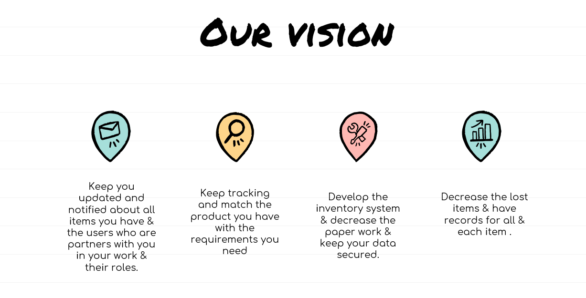
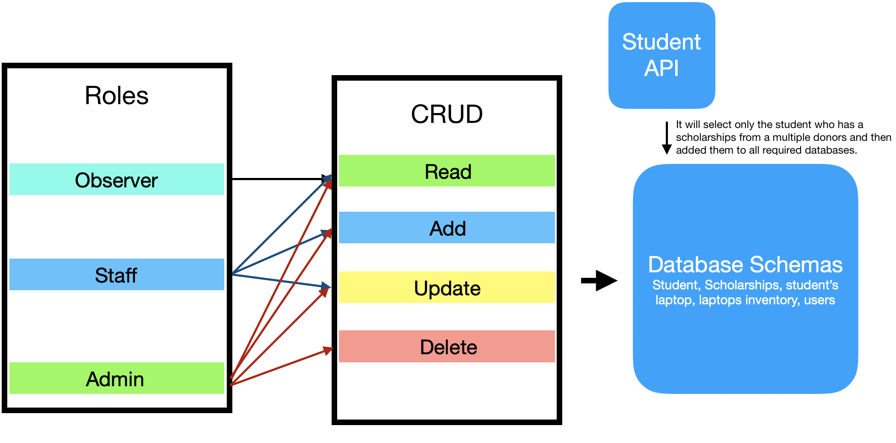
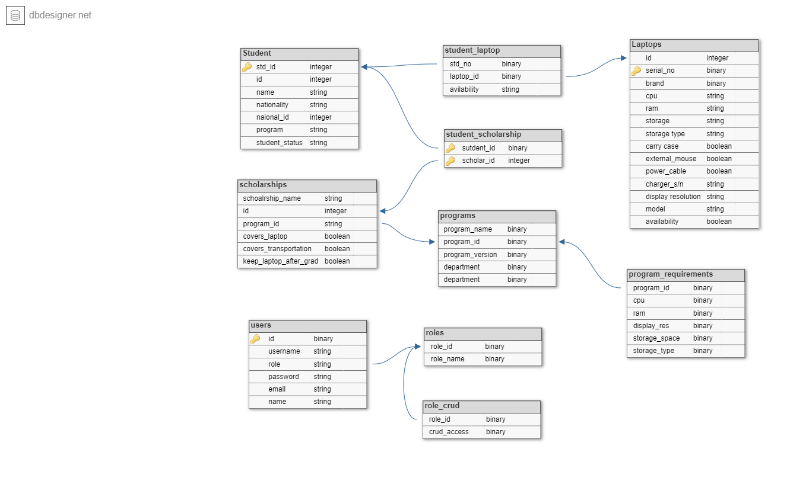

# Laptoptory

## Member name
- Aisha Satouf
- Aseel Mesmar
- Husam Ajour
- Abdulrahman Al-janabi

## Brief Description of the project & problem domain
Many companies and universities gives laptops to their students or employees to help them in work or education process , those laptops specified by certain requirements & it's hard to keep a track on each laptop either by the requirements or even the status if the company/university get back the laptop when the employee/student dropped off.

Our system is a web application that will track all the student's or employee's laptop status, whether they get one from the inventory, or returns the laptop to it. Also, the user can check the persons information, and the list of laptops in the inventory that matches the specified requirements & assign matched laptops to specific person & gives a tracking informations to the user about all the saved laptops in the database.

## Vision

## Wireframe

## Domain Modeling

## Database Schema

## User Story
**[Trello Managment Board](https://trello.com/b/Oz51vJqM/laptoptory)**

## Workflow 
**[Trello Board](https://trello.com/b/NQyKS4TG/laptoptory)**

## Entity Relationship Diagram

## Stretch Goals

