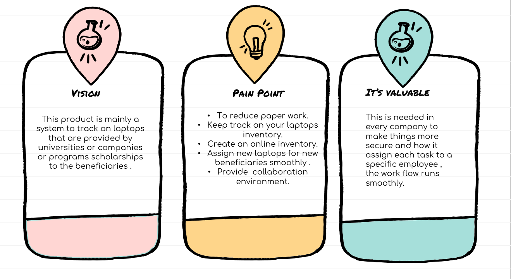
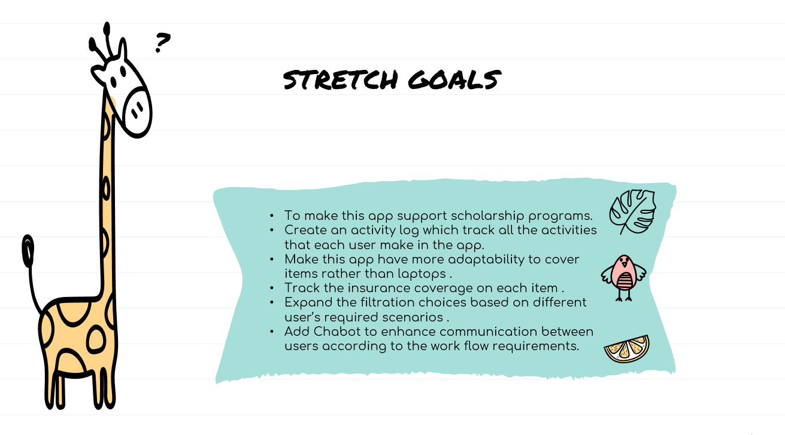
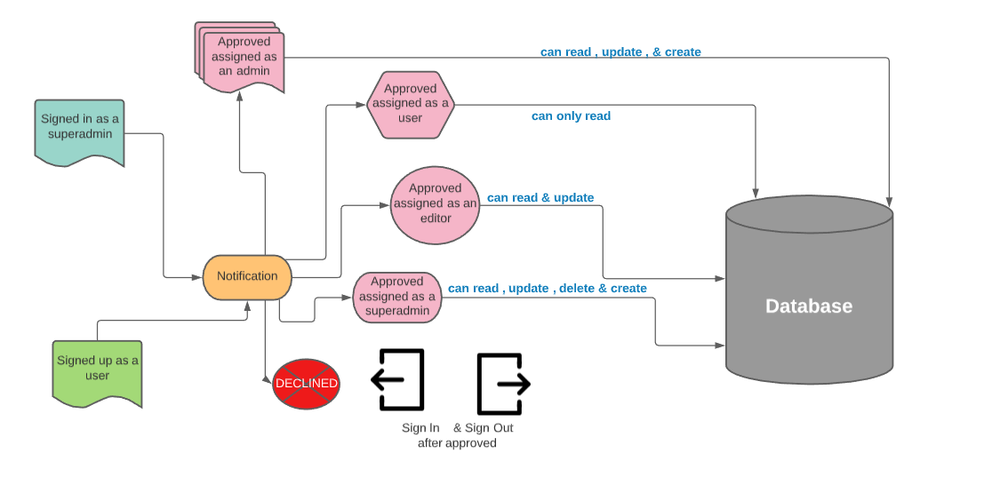

# Software Requirements

## Vision :

## Scope (In/Out) :

* **Scope In** 

 * Our App will provide you with an organized system that serves as inventory system.
 * It will save all your laptop's data & your beneficiaries data .
 * This system will assign a laptop for a specific person either employee or student & based on the requirements the program needs.
 * This application includes role based control system that provides a role for each user and based on this role the capabilities of the user to change and interact with the database will depend on it.
 * This system provides you with security so a superadmin can assign and approve the roles and capabilities for the others so the manager can control the tasks that the users can do(employees).

* **Scope Out**

  * Our system will never turn into an IOS or Android app.

***Minimum Viable Product***

 * The authorized admin can insert data about each new laptop .
 * The authorized admin or user can insert data about new programs and scholarships.
 * The authorized admin or user can fitch data about students or employees and check their status , and check if they have a laptop or not.
 * The authorized admin can add new requirements for each program or scholarship and find the matched laptops available in the inventory.
 * The authorized user or admin can update or delete a sepcific data from the database based on his/her role.
 * The superadmin can give the authority for specific users to interact with our application and this superadmin could be a manager and those users could be the employees
 responsible for inventory related work.

***Stretch Goals***

## Functional Requirements

 * As a user, I want able to view the laptop inventory whether they are available or not.
 * As a user, I want to read a specified student information, including their program enrollment, scholarship, id, name and projects.
 * As a user, Which student or employee currently has a laptop and vice versa.
 * As a user, check the student or employee status where they should return the laptop or not.
 * As a user,  I can check the program details and what exactly their required laptop’s specification.
 * As a user, I want to see if there are laptops that are available and match for a specified program.
 * As a user, I am able to update any information related to the laptop inventory.
 * As a user, I can create a certain record for the laptop inventory.
 * As a superadmin, I want to control all the authorization processes in my system.
 * As a superadmin, I want to assign new roles for new or previous users.

***Data Flow***

## Non-Functional Requirements :

 * Security , we provide role based control system only authorized users can access it & specified with data provided related to the company & we used access token & cookies to save the data of signed up & authorized users.
 * Testabilty , we provide unit tests for the database Implementation and routes , we used postman tool to test our routes.

 

